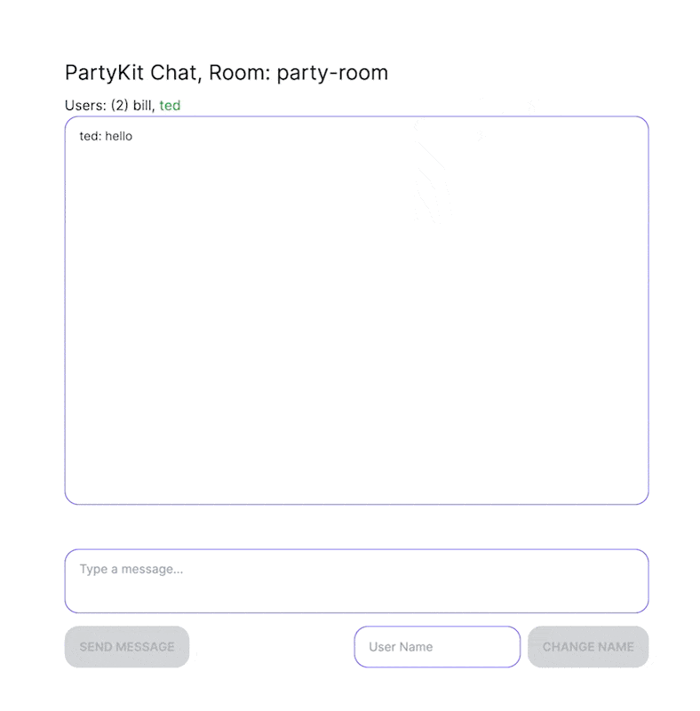

# PartyKit with Next/React /w React Context

> [!WARNING]  
> Archived: was built on top of an old version of PartyKit

<p align="center">
    
</p>

## Description

This is a basic chat application with rooms using Next/React + PartyKit.
The purpose behind this is to demo one way of creating a React app with PartyKit.

## Quick Start

```shell
npm install
npm run dev-party
```

This runs the PartyKit server on `localhost:1999` and the Next application on `localhost:3000`.
Visit `localhost:3000` will display the Next Chat application.

## What features this simple application has

- Ability to have separate rooms
- Ability to change your chat username
- "Who's typing" functionality commonly seen in chat applications

## How it works

I wanted to see if I could leverage React Context to kind of handle all the PartyKit interaction between the websocket server and the React components. I wanted the components to be kept simple and just hook into the messages.

There's a main Provider called [SocketProvider](https://github.com/mikedidomizio/partykit-chat/blob/main/src/providers/Socket/SockerProvider.tsx) that handles the PartyKit connection. The Context provides a wrapper for the PartyKit connection that provides a `sendJson` function that
child providers can use to send messages to the server.

Each child provider is to be kept simple and single concern. The idea behind this is to keep things readable, maintainable, and easier to debug.

In this repo there is a [UsersProvider](https://github.com/mikedidomizio/partykit-chat/blob/main/src/providers/Users/UsersProvider.tsx) that handles what happens when a user joins, leaves, who the user is, with the ability to also set their name.

As well as a [MessageProvider](https://github.com/mikedidomizio/partykit-chat/blob/main/src/providers/Messages/MessageProvider.tsx) that handles the chat portion of the application, messages in/out. The separation of these two Providers prevents information bleeding between the two. It allows us to continue adding more functionality as well through additional Providers as we see fit, without having to update the old code.

Each provider comes with a "server" file that also keeps the PartyKit `server` file clean.  
Each one has its own `onConnect`, `onMessage`, `onClose` that way it's clear how each one works separately.

By using React Context, any parts of the application can communicate through PartyKit easily.

This project is set up to send JSON between the client and the Socket server. The `SocketProvider` comes with a `useSocketMessage`
that is a React hook that will only fire the callback function when the second parameter matches the message

```typescript jsx
useSocketMessage<User[]>((obj) => {
  setUsers(obj); // set the React component state with the message from the websocket message
}, "users"); // when a message from the server comes back with `users` key in the object, the callback function will fire
```

This allows you to build small hook functions and not have to have a bunch of if/else statements in your components.
